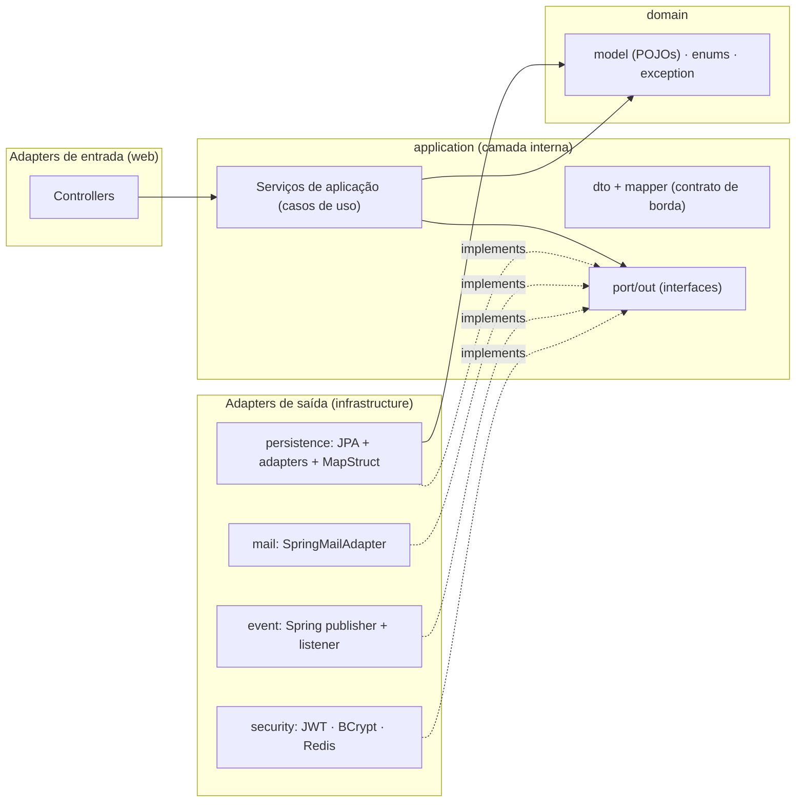
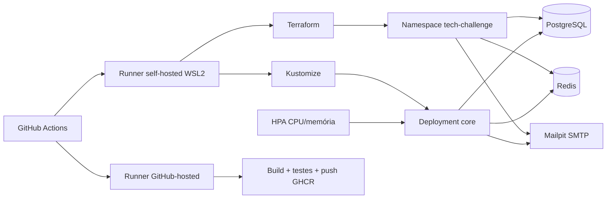

# The Java Garage — Sistema de Atendimento e Execução de Serviços

> **Tech Challenge — Fase 1 e Fase 2 | Pós Tech FIAP 15SOAT**

Back-end do sistema integrado de atendimento para oficina mecânica, com foco em gestão de ordens de
serviço, clientes e peças, aplicando **Domain-Driven Design (DDD)** sobre uma **Arquitetura
Hexagonal (Ports & Adapters)**, com qualidade de software, segurança e, na Fase 2, orquestração em
Kubernetes, infraestrutura como código e pipeline de CI/CD.

---

## Contexto e Proposta

Uma oficina mecânica de médio porte utilizava anotações manuais e planilhas para gerenciar atendimentos, diagnósticos, execução e entrega de veículos. Isso gerava erros na priorização dos atendimentos, falhas no controle de peças, dificuldade de acompanhar status dos serviços, perda de histórico de clientes e ineficiência no fluxo de orçamentos e autorizações.

O sistema resolve esses problemas permitindo:

- Acompanhar o andamento da OS em tempo real via API (sem necessidade de login)
- Receber e-mail a cada mudança de status da OS
- Autorizar ou rejeitar orçamentos diretamente pelo cliente via link/OTP
- Controlar estoque de peças e insumos com auditoria por movimentação
- Gerenciar toda a operação interna com autenticação JWT por papel (Mecânico / Atendente)

### Objetivos da Fase 2

A Fase 2 evolui o back-end da Fase 1 para atender qualidade, resiliência e escalabilidade:

- **Migração para Arquitetura Hexagonal (Ports & Adapters)**: domínio livre de framework
  (POJOs sem JPA/Hibernate/Bean Validation), persistência e I/O atrás de _ports_ com _adapters_
  em `infrastructure/`
- Abertura de OS com serviços e peças opcionais já no ato do cadastro
- Listagem priorizada de OS (ordem de negócio + exclusão de Finalizada/Entregue por padrão)
- Notificação do cliente por e-mail a cada mudança de status da OS
- Deploy em **microk8s** local via **Kustomize**, com HPA, ConfigMaps e Secrets
- Infraestrutura de apoio (namespace, PostgreSQL, Redis e Mailpit) provisionada via
  **Terraform**
- **Pipeline CI/CD** (GitHub Actions, runners GitHub-hosted e self-hosted) rodando build, testes,
  publicação da imagem e deploy

---

## Domínio (DDD)

### Bounded Contexts

```
┌──────────────────────────────────┐   ┌────────────────────────────────┐
│   Attendance (Core Domain)       │   │   Inventory (Supporting)       │
│                                  │   │                                │
│  Aggregate: ServiceOrder         │◄──│  Aggregate: Product            │
│  Aggregate: Customer             │   │  Entity:    StockMovement      │
│  Aggregate: Vehicle              │   └────────────────────────────────┘
│  Aggregate: MechanicalService    │
│  Entity:    Quote                │
└──────────────────────────────────┘
          ▲
          │ (Auth via JWT)
┌─────────┴────────────────────────┐
│   Identity (Generic Domain)      │
│   JWT Authentication             │
└──────────────────────────────────┘
```

- **Attendance** — contexto central; controla o ciclo de vida completo da Ordem de Serviço.
- **Inventory** — suporte; gerencia produtos, quantidades e movimentações de estoque.
- **Identity** — genérico; provê autenticação JWT sem lógica de negócio.

### Ciclo de Vida da Ordem de Serviço

```
RECEIVED → IN_DIAGNOSIS → AWAITING_APPROVAL → IN_PROGRESS → COMPLETED → DELIVERED
                                                   │
                                                   ├──► AWAITING_APPROVAL  (produto não orçado adicionado em execução)
                                                   ├──► CANCELLED          (orçamento expirado após 7 dias ou rejeitado)
                                                   └──► DISPUTED           (rejeição persistente na vistoria de entrega)
```

A cada transição de status persistida com sucesso (inclusive a abertura, que "transiciona" para
`RECEIVED`), o cliente recebe um e-mail com o identificador da OS e o novo status. Falha de SMTP é
registrada em log e **não** reverte a transição já persistida.

### Linguagem Ubíqua

| Termo | Definição |
|---|---|
| **Ordem de Serviço (OS)** | Registro central do atendimento; agrega serviços, produtos, orçamento e status. |
| **Orçamento** | Composição de valores gerada automaticamente após o diagnóstico (ou já na abertura, se houver itens). |
| **Aprovação de Orçamento** | Ação do Cliente autorizando a execução via OTP, sem necessidade de conta. |
| **Produto** | Termo guarda-chuva para Peças e Insumos controlados no estoque. |
| **Atendente** | Colaborador responsável pelo cadastro e acompanhamento administrativo da OS. |
| **Mecânico / Técnico** | Colaborador responsável pelo diagnóstico e execução dos serviços. |

---

## Stack

| Camada | Tecnologia |
|---|---|
| Linguagem | Java 25 |
| Framework | Spring Boot 4.1.0 |
| Build | Gradle Kotlin DSL |
| Banco de dados | PostgreSQL 18.4 |
| Cache / Rate limiting | Redis 7 |
| Migrations | Liquibase |
| Segurança | Spring Security + JWT RSA (OAuth2 Resource Server) |
| Documentação | Springdoc OpenAPI 3 (Swagger UI) |
| Mapeamento | MapStruct (DTO ↔ domínio, domínio ↔ entidade JPA) |
| Testes de integração | Testcontainers |
| Cobertura | JaCoCo (gate ≥ 80% LINE em `application`, `validation` e `infrastructure.persistence.adapter`) |
| Trava de arquitetura | ArchUnit (`HexagonalArchitectureTest` no `:core:test`) |
| Orquestração (Fase 2) | Kubernetes (microk8s) via Kustomize |
| IaC (Fase 2) | Terraform |
| CI/CD (Fase 2) | GitHub Actions (runners GitHub-hosted e self-hosted) |

### Arquitetura — Hexagonal (Ports & Adapters)

Back-end monolítico em **Arquitetura Hexagonal**, aplicando a **Regra de Dependência** da Clean
Architecture: as setas apontam sempre para dentro (`web` e `infrastructure` dependem de
`application`, que depende de `domain`; `domain` não depende de ninguém). Na Fase 2 o código da
Fase 1 (em camadas Spring, com o domínio sendo as próprias entidades JPA) foi migrado para este
layout.

```
domain/
  model/          →  Núcleo: entidades e regras invariantes como POJOs — sem jakarta.persistence,
                     sem Hibernate, sem Bean Validation. equals/hashCode por identidade de negócio
  enums/          →  Enums de domínio + EApplicationError (com ErrorStatus próprio, sem HttpStatus)
  exception/      →  Exceções de negócio (sem org.springframework.*)

application/       →  Camada interna: serviços de aplicação (casos de uso, @Service, @Transactional)
  serviceorder/   →  Caso de uso ServiceOrder decomposto por fase: ServiceOrderOpeningService,
                     ServiceOrderDiagnosisService, QuoteApprovalService, ServiceOrderExecutionService,
                     ServiceOrderDeliveryService, ServiceOrderDisputeService, ServiceOrderQueryService,
                     sobre 3 colaboradores package-private (ServiceOrderStore, QuoteWorkbench,
                     ServiceOrderResponseFactory)
  dto/            →  DTOs de request/response (records) — o contrato de borda pertence ao núcleo
  mapper/         →  MapStruct DTO ↔ domínio
  port/out/       →  Portas de saída (interfaces): *Repository, MailPort, PasswordHasher,
                     DomainEventPublisher, TokenBlacklistPort, CurrentActorPort
  event/          →  ServiceOrderStatusChangedEvent (record neutro)
  scheduler/      →  Expiração automática de orçamentos (7 dias)

infrastructure/   →  Adapters de saída (frameworks & drivers)
  persistence/
    entity/       →  Entidades JPA (*Entity) — todo o mapeamento @Entity/@Column/@ManyToOne/@Version
    jpa/          →  Interfaces Spring Data (*JpaRepository)
    adapter/      →  *RepositoryAdapter implements application.port.out.*Repository
    mapper/       →  PersistenceMapper (MapStruct) domínio ↔ *Entity, com tratamento de ciclo
                     no agregado Quote
  security/       →  SecurityConfig, filtros JWT, TokenUtility, TokenMapper, UserDetailsImpl (compõe
                     o domain.model.User, não estende), SpringUserDetailsService (UserDetailsService
                     do Spring, isolado da camada de aplicação), BCryptPasswordHasher,
                     RedisTokenBlacklistService, AdminCredentialInitializer,
                     SecurityContextCurrentActorAdapter
  mail/           →  SpringMailAdapter implements MailPort (envolve JavaMailSender)
  event/          →  SpringDomainEventPublisher; StatusEmailNotifier (@TransactionalEventListener)
  config/         →  MessageSource, OpenAPI, PasswordEncoder

web/              →  Adapters de entrada
  controller/     →  @RestController (só tradução HTTP; delega para os casos de uso)
  dto/            →  PageResponseDTO (envelope de paginação exclusivo da borda web)
  exception/      →  @ControllerAdvice (traduz ErrorStatus → HTTP)

util/  validation/ →  Helpers de borda (Translator, WebUtility, AuthUtility) e validadores
                      (@ValidTaxId CPF/CNPJ, @ValidLicensePlate)
```

A **Regra de Dependência é verificada por teste**: `HexagonalArchitectureTest` (ArchUnit) roda
dentro de `:core:test` e falha o build se `domain` ou `application` (incluindo `application.port`)
passarem a depender de `web` ou `infrastructure`, ou se o `domain` ganhar dependência de
Spring/JPA/MapStruct/Jackson. Exceção única e documentada: `AuthenticationService`, que ainda
importa `infrastructure.security` (Spring Security) — dívida técnica registrada para extração
futura em portas de autenticação/token.



**Gate de cobertura (JaCoCo ≥ 80% LINE)** mede os pacotes `application.*` (casos de uso),
`validation.*` e `infrastructure.persistence.adapter` (os adapters JPA, cobertos pelos testes de
integração). Ficam de fora da métrica: `application.dto`, `application.mapper` (glue MapStruct),
controllers, `config`, `exception`, `enums` e `domain`.

### Arquitetura da infraestrutura



O Terraform provisiona as dependências de execução no microk8s existente. O Kustomize
provisiona a aplicação, o Service, o ConfigMap e o HPA. O Secret da aplicação é criado
fora do Git, porque contém a senha do banco, as credenciais SMTP e as chaves JWT.

---

## Pré-requisitos

- **Docker** e **Docker Compose** (recomendado para execução local)
- **JDK 25** e **Gradle** (para execução local sem Docker)
- **microk8s** no WSL2 com `kubectl` e Kustomize — para deploy em Kubernetes
- Addons microk8s `dns`, `hostpath-storage` e `metrics-server`
- **Terraform** ≥ 1.6 — para provisionar recursos via `/infra`
- Repositório GitHub com Actions habilitado — para validar o CI/CD

---

## Como Executar

### Com Docker Compose (recomendado para desenvolvimento)

```bash
docker-compose up --build
```

Isso sobe a aplicação, o PostgreSQL, o Redis e o Mailpit (servidor SMTP local que captura os e-mails
de OTP e de notificação de status em desenvolvimento — acesse `http://localhost:8025`). A aplicação
estará disponível em `http://localhost:8080/core`.

Para parar:

```bash
docker-compose down
```

### Executando localmente (sem Docker)

```bash
# 1. Suba o banco de dados
docker run -d \
  --name tech-pg \
  -e POSTGRES_USER=techdev \
  -e POSTGRES_PASSWORD=techdevpw \
  -e POSTGRES_DB=techbase \
  -p 5432:5432 \
  postgres:18.4-alpine

# 2. Execute a aplicação
./gradlew :core:bootRun
```

A aplicação sobe em `http://localhost:8080/core`.

Swagger UI disponível em: `http://localhost:8080/core/swagger-ui.html`

### Kubernetes local (microk8s + Kustomize)

Manifests em `/k8s`, organizados em `base` (Deployment, Service, ConfigMap, Secret de exemplo, HPA) e
overlay `local` (imagem do GHCR, NodePort, requests reduzidos para o nó único do WSL2). O workflow
de CI/CD publica a imagem em `ghcr.io/<owner-do-repositório>/tech-challenge-core` (namespace
derivado de `github.repository_owner`); o pacote é privado e o cluster o baixa autenticado via
Secret `ghcr-pull` (`imagePullSecrets` em `k8s/base/deployment.yaml`), provisionado pelo Terraform
quando `ghcr_pull_token` é informado:

```bash
# 1. Verifique o cluster e habilite os addons necessários
microk8s status --wait-ready
microk8s enable dns hostpath-storage metrics-server
microk8s kubectl get nodes

# 2. Provisione namespace, PostgreSQL, Redis e Mailpit
cd infra
cp terraform.tfvars.example terraform.tfvars
# Edite terraform.tfvars: informe db_password e, para puxar a imagem privada do GHCR,
# ghcr_pull_token (PAT com escopo read:packages)
terraform init
terraform plan -var-file=terraform.tfvars
terraform apply -var-file=terraform.tfvars
cd ..

# 3. Crie o Secret real da aplicação fora do Git
kubectl -n tech-challenge create secret generic tech-challenge-core-secret \
  --from-literal=jdbc-username=techdev \
  --from-literal=jdbc-password='<mesma senha do Terraform>' \
  --from-literal=mail-username=noreply@tech.local \
  --from-literal=mail-password='' \
  --from-file=jwt-public-key=core/src/main/resources/certs/dev-public.pem \
  --from-file=jwt-private-key=core/src/main/resources/certs/dev-private.pem

# 4. Revise e aplique o overlay Kustomize
kubectl kustomize k8s/overlays/local
kubectl apply -k k8s/overlays/local

# 5. Em uma execução manual, fixe a tag publicada desejada (ajuste o owner do seu GHCR)
kubectl -n tech-challenge set image deployment/core \
  core=ghcr.io/<owner>/tech-challenge-core:latest
```

A aplicação responde em `http://<ip-do-node>:30080/core`. Para descobrir o IP do
node, execute `hostname -I` no WSL2. Detalhes completos estão em
[`k8s/overlays/local/README.md`](k8s/overlays/local/README.md).

Para acompanhar o deploy:

```bash
kubectl -n tech-challenge get pods,services,hpa
kubectl -n tech-challenge rollout status deployment/core --timeout=180s
curl http://<ip-do-node>:30080/core/actuator/health
```

Para visualizar os e-mails capturados pelo Mailpit:

```bash
kubectl -n tech-challenge port-forward service/mailpit 8025:8025
```

Acesse `http://localhost:8025`.

### Terraform (infraestrutura de apoio)

O diretório `/infra` provisiona, via Terraform, o namespace, PostgreSQL, Redis e
Mailpit **sobre um microk8s já instalado**. O Terraform não instala o cluster:

```bash
cd infra
terraform init
cp terraform.tfvars.example terraform.tfvars   # defina db_password real
terraform plan -var-file=terraform.tfvars
terraform apply -var-file=terraform.tfvars
```

Passo a passo completo, variáveis, Secret da aplicação e outputs estão em
[`infra/README.md`](infra/README.md).

### CI/CD

O workflow [`.github/workflows/ci-cd.yml`](.github/workflows/ci-cd.yml) usa runners GitHub-hosted
para build, testes e publicação da imagem no GHCR. Os jobs de Terraform e deploy usam um runner
**self-hosted** no WSL2 com acesso ao microk8s. O runner local não precisa acessar o Docker Hub nem
o registry local do microk8s.

#### Configurar o runner

1. No GitHub, abra **Settings → Actions → Runners → New self-hosted runner**.
2. Selecione **Linux** e **x64**.
3. No WSL2, execute os comandos de instalação exibidos pelo GitHub.
4. Configure o runner com as labels `wsl2,microk8s`.
5. Inicie-o com `./run.sh` e confirme que aparece como **Idle** no GitHub.

O usuário do runner precisa executar os seguintes comandos sem intervenção de senha:

```bash
terraform version
kubectl get nodes
```

Crie os Secrets do repositório em **Settings → Secrets and variables → Actions**:

| Secret | Valor |
|---|---|
| `TF_VAR_DB_PASSWORD` | Mesma senha usada pelo PostgreSQL (`db_password`) |
| `GHCR_PULL_TOKEN` | PAT com escopo `read:packages` no namespace `ghcr.io/<owner-do-repo>`. O job `terraform-apply` o passa como `TF_VAR_ghcr_pull_token`, e o Terraform cria o Secret `ghcr-pull` no namespace para o microk8s baixar a imagem privada. Só necessário se o pacote for privado |
| `JWT_PUBLIC_KEY` *(opcional)* | PEM completo da chave pública JWT. Se ausente, o `deploy` usa `core/src/main/resources/certs/dev-public.pem` do repo |
| `JWT_PRIVATE_KEY` *(opcional)* | PEM completo da chave privada JWT. Se ausente, usa `core/src/main/resources/certs/dev-private.pem`. Defina os dois para produção — **não use as chaves `dev-*` fora de dev** |

O job `deploy` monta o Secret `tech-challenge-core-secret` no cluster automaticamente: `jwt-*`
dos GitHub Secrets acima **ou** das chaves `dev-*` versionadas no repo; `jdbc-*` lidos do Secret
`postgres-credentials` que o Terraform criou; `mail-*` vazios (Mailpit). É idempotente — roda a
cada deploy. **Para o desafio não precisa configurar nada** — as chaves `dev-*` do repo bastam.

Para produção, defina os dois com o `gh` CLI (a partir de chaves suas, não as `dev-*`):

```bash
gh secret set JWT_PUBLIC_KEY  --repo fiap-pos-2026/tech-challenge-2 < caminho/public.pem
gh secret set JWT_PRIVATE_KEY --repo fiap-pos-2026/tech-challenge-2 < caminho/private.pem
```

Antes do primeiro workflow, migre o estado do Terraform para o backend `local` seguindo o
procedimento em [`infra/README.md`](infra/README.md#estado-do-terraform-backend-local). Sem essa
migração, o CI não reconhece recursos criados manualmente e tenta recriá-los.

O job `docker-image` publica no GHCR autenticado pelo **`GITHUB_TOKEN`** automático — funciona
sem PAT porque `IMAGE_NAME` usa `ghcr.io/${{ github.repository_owner }}/...`, ou seja, o
namespace sempre casa com o owner do repositório que roda o workflow (o mesmo workflow serve o
repo do org e um fork). Em **Settings → Actions → General**, confirme que o repositório permite
que workflows criem e publiquem pacotes. O pacote `tech-challenge-core` fica **privado**: o
microk8s faz o pull autenticado pelo Secret `ghcr-pull` (provisionado pelo Terraform a partir de
`GHCR_PULL_TOKEN`). Se preferir, torne o pacote **público** e o `GHCR_PULL_TOKEN` deixa de ser
necessário.

#### Gatilhos do workflow

| Gatilho | Estágios executados |
|---|---|
| Push em `main` ou `feature/tech-challenge-2` | Build, testes, imagem, Terraform e deploy |
| Pull Request para `main` | Build e testes |
| `workflow_dispatch` | Build, testes, imagem, Terraform e deploy |

Nos eventos de `push` e `workflow_dispatch`, a cadeia completa é:

```text
build-and-test → docker-image → terraform-apply → deploy
```

O job `docker-image` publica as tags `latest` e o SHA do commit em
`ghcr.io/<owner-do-repositório>/tech-challenge-core`. O deploy fixa o Deployment na tag SHA, garantindo
que o cluster execute a mesma imagem validada no job de build. Qualquer falha em build, testes,
imagem ou Terraform bloqueia os estágios seguintes.

---

## Variáveis de Ambiente

### JWT RSA

As chaves de desenvolvimento já estão em `core/src/main/resources/certs/`. **Não use essas chaves em produção.**

Para produção, forneça via variáveis de ambiente:

```
JWT_PUBLIC_KEY=<conteúdo ou caminho file: da chave pública PEM>
JWT_PRIVATE_KEY=<conteúdo ou caminho file: da chave privada PEM>
```

### Banco de Dados

```
JDBC_HOST=localhost
JDBC_PORT=5432
JDBC_SERVICENAME=techbase
JDBC_USERNAME=techdev
JDBC_PASSWORD=techdevpw
```

### Redis

```
REDIS_HOST=localhost
REDIS_PORT=6379
```

Introduzido exclusivamente para suportar a funcionalidade de log-out com invalidação imediata de tokens JWT, 
implementada via blacklist. No docker-compose e no Kustomize já está configurado apontando para o serviço `redis`.

### E-mail (OTP e notificação de status)

```
MAIL_HOST=smtp.seu-provedor.com
MAIL_PORT=587
MAIL_USERNAME=seu-usuario
MAIL_PASSWORD=sua-senha
MAIL_SMTP_AUTH=true
MAIL_SMTP_STARTTLS=true
```

Em desenvolvimento, o docker-compose sobe um **Mailpit** em `http://localhost:8025` que captura
localmente tanto os e-mails de OTP quanto os de notificação de mudança de status, sem enviá-los de
fato.

### Senha Inicial do Administrador

Na primeira inicialização, a aplicação detecta que o usuário `admin` ainda não trocou a senha e:

1. Se `ADMIN_INITIAL_PASSWORD` estiver definida como variável de ambiente, usa esse valor.
2. Caso contrário, **gera automaticamente uma senha aleatória de 16 caracteres**.
3. Em ambos os casos, **imprime a senha nos logs** com destaque:

```
=================================================================
  CREDENCIAL INICIAL DO ADMINISTRADOR
  Login : admin
  Senha : xK3@mQ7!rBv2#Yz9
  ALTERE ESTA SENHA IMEDIATAMENTE APÓS O PRIMEIRO LOGIN.
=================================================================
```

Após o primeiro login, o sistema bloqueia todas as operações e exige a troca da senha em `PUT /api/profile/password`.

---

## Endpoints da API

Context path: todos os caminhos são servidos sob `/core` (ex.: `POST /core/api/signin`).
`ADMIN` acumula as permissões de `ATTENDANT`.

### Autenticação e Perfil

| Método | Caminho | Auth | Descrição |
|---|---|---|---|
| `POST` | `/api/signin` | Público | Autenticação — retorna JWT (RS256) |
| `POST` | `/api/signout` | JWT | Logout — invalida o token na blacklist (Redis) |
| `GET` | `/api/profile` | JWT | Dados do usuário autenticado |
| `PUT` | `/api/profile/password` | JWT | Troca de senha (obrigatória no primeiro login) |

### Usuários internos

| Método | Caminho | Papel | Descrição |
|---|---|---|---|
| `POST` | `/api/users` | ADMIN | Cadastrar Atendente ou Mecânico |
| `GET` | `/api/users` | ADMIN | Listar usuários |
| `GET` | `/api/users/{uuid}` | ADMIN | Buscar por ID |
| `PUT` | `/api/users/{uuid}` | ADMIN | Atualizar usuário |
| `DELETE` | `/api/users/{uuid}` | ADMIN | Remover usuário |

### Clientes

| Método | Caminho | Papel | Descrição |
|---|---|---|---|
| `POST` | `/api/customers` | ADMIN, ATTENDANT | Cadastrar cliente (CPF ou CNPJ) |
| `GET` | `/api/customers?document={cpfCnpj}` | ADMIN, ATTENDANT | Buscar por CPF/CNPJ (query param) |
| `GET` | `/api/customers/{uuid}` | ADMIN, ATTENDANT | Buscar por ID (documento mascarado) |
| `GET` | `/api/customers/{uuid}/document` | ADMIN, ATTENDANT | Documento completo, sem máscara |
| `PUT` | `/api/customers/{uuid}` | ADMIN, ATTENDANT | Atualizar cliente |
| `DELETE` | `/api/customers/{uuid}` | ADMIN, ATTENDANT | Remover cliente (409 se houver OS ativa) |

### Veículos

| Método | Caminho | Papel | Descrição |
|---|---|---|---|
| `POST` | `/api/vehicles` | ADMIN, ATTENDANT | Cadastrar veículo |
| `GET` | `/api/vehicles?licensePlate={placa}` | ADMIN, ATTENDANT, MECHANIC | Buscar por placa (query param) |
| `GET` | `/api/vehicles/{uuid}` | ADMIN, ATTENDANT, MECHANIC | Buscar por ID |
| `PUT` | `/api/vehicles/{uuid}` | ADMIN, ATTENDANT | Atualizar veículo |
| `DELETE` | `/api/vehicles/{uuid}` | ADMIN, ATTENDANT | Remover veículo (409 se houver OS ativa) |

### Catálogo de Serviços

| Método | Caminho | Papel | Descrição |
|---|---|---|---|
| `POST` | `/api/catalog/services` | ADMIN, ATTENDANT | Cadastrar serviço |
| `GET` | `/api/catalog/services` | ADMIN, ATTENDANT, MECHANIC | Listar (paginado) |
| `GET` | `/api/catalog/services/{uuid}` | ADMIN, ATTENDANT, MECHANIC | Buscar por ID |
| `PUT` | `/api/catalog/services/{uuid}` | ADMIN, ATTENDANT | Atualizar serviço |
| `GET` | `/api/catalog/services/avg-duration` | ADMIN, ATTENDANT, MECHANIC | Tempo médio de execução por serviço |
| `DELETE` | `/api/catalog/services/{uuid}` | ADMIN, ATTENDANT | Remover serviço (409 se vinculado a OS ativa) |

### Inventário (produtos e estoque)

| Método | Caminho | Papel | Descrição |
|---|---|---|---|
| `POST` | `/api/inventory/products` | ADMIN, ATTENDANT | Cadastrar produto/insumo (`type`: `PART`/`SUPPLY`) |
| `GET` | `/api/inventory/products` | ADMIN, ATTENDANT, MECHANIC | Listar (paginado) |
| `GET` | `/api/inventory/products/{uuid}` | ADMIN, ATTENDANT, MECHANIC | Buscar por ID |
| `PUT` | `/api/inventory/products/{uuid}` | ADMIN, ATTENDANT | Atualizar produto |
| `DELETE` | `/api/inventory/products/{uuid}` | ADMIN, ATTENDANT | Remover produto |
| `POST` | `/api/inventory/products/{uuid}/replenishment` | ADMIN, ATTENDANT | Repor estoque (incrementa saldo + movimento `REPLENISHMENT`) |
| `POST` | `/api/inventory/manual-adjustment` | ADMIN, ATTENDANT | Ajuste manual (só auditoria — não altera saldo) |
| `GET` | `/api/inventory/movements` | ADMIN, ATTENDANT | Listar movimentações (filtro opcional `productId`) |

### Ordens de Serviço

| Método | Caminho | Papel | Descrição |
|---|---|---|---|
| `POST` | `/api/service-orders` | ADMIN, ATTENDANT | Abrir OS com a queixa do cliente e, opcionalmente, serviços/peças já na abertura (orçamento provisório) |
| `GET` | `/api/service-orders` | ADMIN, ATTENDANT, MECHANIC | Listar priorizado (`IN_PROGRESS` > `AWAITING_APPROVAL` > `IN_DIAGNOSIS` > `RECEIVED`, depois `createdAt` ASC); exclui `COMPLETED`/`DELIVERED` por padrão; filtros: `status`, `customerUuid`, `from`, `to` |
| `GET` | `/api/service-orders/{uuid}` | ADMIN, ATTENDANT, MECHANIC | Detalhar OS (com orçamento) |
| `GET` | `/api/service-orders/{uuid}/status` | **Público** | Consultar status (cliente) |
| `POST` | `/api/service-orders/{uuid}/diagnosis/start` | ADMIN, MECHANIC | Iniciar diagnóstico |
| `POST` | `/api/service-orders/{uuid}/diagnosis/services` | ADMIN, MECHANIC | Adicionar serviço ao diagnóstico |
| `DELETE` | `/api/service-orders/{uuid}/diagnosis/services/{mechanicalServiceUuid}` | ADMIN, MECHANIC | Remover serviço do diagnóstico |
| `POST` | `/api/service-orders/{uuid}/diagnosis/products` | ADMIN, MECHANIC | Adicionar produto ao diagnóstico |
| `DELETE` | `/api/service-orders/{uuid}/diagnosis/products/{productUuid}` | ADMIN, MECHANIC | Remover produto do diagnóstico |
| `POST` | `/api/service-orders/{uuid}/diagnosis/complete` | ADMIN, MECHANIC | Concluir diagnóstico (gera orçamento + envia OTP) |
| `POST` | `/api/service-orders/{uuid}/approval` | **Público (OTP)** | Aprovar ou rejeitar o orçamento |
| `POST` | `/api/service-orders/{uuid}/otp/resend` | ADMIN, ATTENDANT | Reenviar OTP |
| `POST` | `/api/service-orders/{uuid}/execution/products` | ADMIN, MECHANIC | Requisitar produto na execução (débito de estoque; item não orçado abre adendo + novo OTP) |
| `DELETE` | `/api/service-orders/{uuid}/products/{productUuid}` | ADMIN, ATTENDANT | Devolver produto ao estoque (exige reautenticação por senha) |
| `POST` | `/api/service-orders/{uuid}/execution/complete` | ADMIN, MECHANIC | Concluir execução |
| `POST` | `/api/service-orders/{uuid}/delivery/accept` | **Público** | Aceitar entrega — Atendente via JWT ou Cliente via OTP |
| `POST` | `/api/service-orders/{uuid}/delivery/reject` | **Público (OTP)** | Rejeitar entrega (volta para retrabalho) |
| `POST` | `/api/service-orders/{uuid}/close-dispute` | ADMIN, ATTENDANT | Encerrar OS como `DISPUTED` |

### Notificações

| Método | Caminho | Papel | Descrição |
|---|---|---|---|
| `GET` | `/api/notifications` | ADMIN, ATTENDANT, MECHANIC | Listar notificações do usuário (paginado) |
| `PATCH` | `/api/notifications/{uuid}/read` | ADMIN, ATTENDANT, MECHANIC | Marcar como lida |

Toda transição de status persistida com sucesso — incluindo a abertura — dispara e-mail ao cliente
com o identificador da OS e o novo status (falha de SMTP é logada e não reverte a transição).

### Fluxo de status (happy path)

```
RECEIVED → IN_DIAGNOSIS → AWAITING_APPROVAL → IN_PROGRESS → COMPLETED → DELIVERED
```

---

## Collections e Swagger

- **Swagger UI**: `http://localhost:8080/core/swagger-ui.html` (com a aplicação rodando localmente)
- Duas collections, para propósitos diferentes:

| Pasta | Uso |
|---|---|
| [`collections/`](collections/) | Collection Postman organizada por domínio de negócio, para importar no Postman e explorar manualmente. `baseUrl` padrão `http://localhost:8080/core`. Documentação em [`collections/README.md`](collections/README.md). |
| [`collection/`](collection/) | Collection de **validação ponta a ponta** contra o deploy no cluster, executável com **newman** (gerada por `collection/build.mjs`). Ciclo completo da OS com OTP lido do Mailpit + assertivas. Documentação em [`collection/README.md`](collection/README.md). |

### Fluxo completo (happy path) exercitado pelas duas

```text
Setup (usuários, catálogo, produto+estoque, cliente, veículo)
  → Abrir OS → Consultar status (público)
  → Diagnóstico: iniciar → adicionar serviço/produto → concluir (gera orçamento + OTP)
  → Aprovar orçamento (cliente via OTP)
  → Execução: requisitar produto (adendo + novo OTP) → aprovar adendo → concluir
  → Aceitar entrega (Atendente via JWT) → status final DELIVERED
  → Notificações: listar → marcar como lida
```

### Rodando a collection de validação com newman

```bash
newman run collection/tech-challenge-api.postman_collection.json \
  --reporters cli,json --reporter-json-export collection/newman-report.json
```

O `baseUrl` e `mailpitUrl` já vêm apontados para o NodePort do microk8s; ajuste em
`collection/build.mjs` (e rode `node collection/build.mjs`) ou sobrescreva com `--env-var`.

---

## Executando os Testes

```bash
# Todos os testes (unitários + integração)
./gradlew :core:test

# Relatório de cobertura (HTML em core/build/reports/jacoco/test/html/index.html)
./gradlew :core:jacocoTestReport

# Verificação do gate de cobertura (≥ 80% nos domínios críticos)
./gradlew :core:jacocoTestCoverageVerification

# Build completo (usado como gate de CI)
./gradlew :core:build -x dependencyCheckAnalyze

# Análise de dependências OWASP
./gradlew :core:dependencyCheckAnalyze
```

Os testes de integração sobem um PostgreSQL real via Testcontainers — o Docker precisa estar rodando.

Qualquer teste falhando derruba `:core:test` e, na pipeline, bloqueia imagem e deploy. Para inspecionar
o relatório completo localmente sem interromper o build na primeira falha, exporte
`IGNORE_TEST_FAILURES=true` — a pipeline fixa essa variável em `false` e ignora o override.

---

## Segurança

### Autenticação e Autorização

- **JWT RSA (RS256)** — tokens assinados com par de chaves RSA; chaves nunca commitadas, fornecidas via variável de ambiente
- **RBAC** — papéis `ADMIN`, `ATTENDANT` e `MECHANIC` (`ADMIN` acumula as permissões de `ATTENDANT`); `@PreAuthorize` em todos os endpoints protegidos, com `@EnableMethodSecurity`
- **Endpoints públicos** — consulta de status, aprovação de orçamento e vistoria de entrega acessíveis sem JWT (cliente acessa via OTP)

### Validações de Domínio

- **CPF/CNPJ** — algoritmo Módulo 11 com dígitos verificadores (`@ValidTaxId`)
- **Placa de veículo** — formatos antigo (`AAA9999`) e Mercosul (`AAA9A99`) via regex (`@ValidLicensePlate`)
- **Senhas** — BCrypt; complexidade mínima: 8 caracteres, ao menos uma maiúscula, um número e um símbolo
- **Sem stack trace** — respostas de erro padronizadas via `@ControllerAdvice`; nunca expõem detalhes internos

### Segredos (Kubernetes / Terraform)

- Valores sensíveis (senha do banco, credenciais SMTP, chaves JWT) **nunca** entram no git — apenas
  exemplos/placeholders (`k8s/base/secret.example.yaml`, `infra/terraform.tfvars.example`)
- `k8s/.gitignore` e `infra/.gitignore` bloqueiam `secret.yaml`, `*.pem`, `*.tfstate` e `*.tfvars` reais
- Segredos reais são criados diretamente no cluster (`kubectl create secret`) ou via variável
  `TF_VAR_db_password` / secrets do runner self-hosted no CI

### OWASP A07:2021 — Identification and Authentication Failures

| Controle | Implementação |
|---|---|
| Sem credenciais padrão | `AdminCredentialInitializer` gera senha aleatória na primeira boot |
| Troca de senha obrigatória | Flag `force_change_password`; `PasswordChangeRequiredFilter` bloqueia 100% das rotas até a troca |
| Bloqueio por força bruta (login) | 5 tentativas → bloqueio de 15 min |
| Bloqueio por força bruta (troca de senha) | 5 tentativas de senha atual errada → bloqueio de 15 min |
| Reutilização de senha proibida | `changePassword` rejeita nova senha igual à atual |
| JWT com expiração | RS256 com expiração configurável via `jwt.expiry.duration` |
| Invalidação de token por hash | `TokenUtility.validate()` cruza claim `hash` com o banco |
| Conta inativa bloqueada | `JWTAuthorizationFilter` verifica flag `active` a cada request |
| Reautenticação para operações críticas | Devolução de produto exige confirmação de senha do Atendente |

### OWASP A09:2021 — Security Logging and Monitoring Failures

Todos os eventos críticos são registrados em `security_audit_log`:

| Evento | `AuditEventType` |
|---|---|
| Login bem-sucedido | `LOGIN_SUCCESS` |
| Login com credenciais inválidas | `LOGIN_FAILED` |
| Conta bloqueada | `OTP_INVALID_LIMIT` |
| Troca de senha bem-sucedida | `PASSWORD_CHANGED` |
| Reautenticação bem-sucedida | `REAUTHENTICATION_SUCCESS` |
| Reautenticação falha | `REAUTHENTICATION_FAILED` |
| Mudança de papel (role) | `USER_ROLE_CHANGED` |
| Encerramento de disputa | `DISPUTED_CLOSURE` |

---

## Relatórios de Segurança

| Relatório | Localização |
|---|---|
| Análise de vulnerabilidades da imagem Docker (Trivy) | [`reports/security/`](reports/security/README.md) |

---

## Justificativa da Escolha do Banco de Dados

O **PostgreSQL 18.4** foi escolhido pelas seguintes razões:

- **ACID completo** — operações de débito de estoque, aprovação de orçamento e transição de status da OS exigem transações com isolamento forte para evitar race conditions (ex.: `SELECT FOR UPDATE` no `StockService` para débito concorrente).
- **Modelo relacional alinhado ao domínio** — a OS centraliza relacionamentos entre `Customer`, `Vehicle`, `MechanicalService`, `Product` e `Quote`; o modelo relacional evita redundância e garante consistência referencial por FK.
- **Suporte maduro a JPA/Hibernate e Liquibase** — dialeto Hibernate estável; Liquibase tem suporte de primeira classe, permitindo migrações versionadas e reversíveis.
- **Compatibilidade com Testcontainers** — imagem oficial `postgres:18.4-alpine` usada nos testes de integração garante o mesmo banco em dev, teste e produção, eliminando discrepâncias de comportamento.
- **Custo e operação acessíveis** — para um sistema monolítico de oficina de porte médio, PostgreSQL gerenciado (RDS, Supabase, etc.) ou em cluster próprio (microk8s/Terraform) tem custo baixo e sem sobrecarga operacional.
